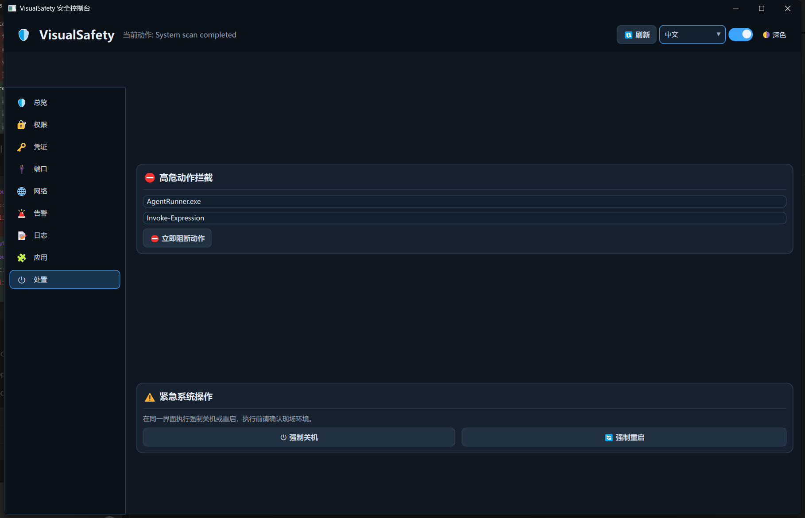

# VisualSafety

VisualSafety 是一个基于 **C++ + Qt6 Quick** 的桌面安全可视化系统，目标是提供类似 Windows 安全控制台的交互体验，监控本机上 AI Agent 与其他工具软件的高危行为，并支持快速阻断与应急处置。

AI开发中......


## 部署安装

- 安装QtCreator和Qt6
- 克隆本项目到本地
- 使用QtCreator打开本项目构建运行

## 1. 项目目标

- 实时监控当前电脑的关键安全面：权限、凭证、端口、网络、应用行为。
- 对 AI Agent 等自动化工具的高风险动作进行检测、告警与阻断。
- 在单一界面完成风险判断与快速处置（阻断动作、强制退出、关机、重启）。
- 提供直观、美观、可扩展的安全可视化 UI。

## 2. 功能范围

### 2.1 权限与高危权限

- 权限列表总览。
- 应用权限使用情况。
- 高危权限调用记录与风险分级展示。

### 2.2 密钥与凭证

- 密钥、Token、凭证信息总览。
- 凭证状态与风险暴露状态展示（如掩码、轮换、托管）。

### 2.3 端口与网络

- 端口占用情况。
- 高危端口识别与动作建议（观察 / 阻断）。
- 网络流量、异常流量、防火墙规则可视化。

### 2.4 告警与通知

- 安全告警与异常行为列表。
- 通知通道开关：
  - 桌面通知
  - 邮件通知
  - 短信通知

### 2.5 日志与应用监控

- 安全日志记录与人工追加日志。
- 应用监控列表（含安全/风险标记）。
- 任意时刻可对应用执行强制退出。

### 2.6 应急处置

- 在同一界面提供：
  - 强制关机
  - 强制重启

## 3. 编码与架构要求

- 使用 **C++ Qt6 Quick** 实现。
- 采用业界常见目录结构（核心逻辑 / 图标管理 / QML 组件 / 页面分层）。
- 架构具备可扩展性，便于后续接入真实系统采集与策略引擎。
- 支持 **深色 / 浅色** 两套主题皮肤。
- 所有图标统一使用 **Emoji**，并通过单一头文件集中声明与管理。
- 代码风格同时遵循：
  - **Google C++ Style Guide**（命名、函数职责、可读性、避免超大函数/文件）。
  - **Qt 编码习惯**（QObject 属性与信号槽设计、QVariant/QML 绑定方式、模块化 `.cpp` 拆分）。

## 4. 当前代码结构

```text
VisualSafety/
├─ CMakeLists.txt
├─ src/
│  ├─ main.cpp
│  ├─ core/
│  │  ├─ securitycontroller.h
│  │  ├─ securitycontroller.cpp               # 控制流、动作、通知、策略执行
│  │  ├─ securitycontroller_collectors.cpp    # 系统数据采集与风险推导
│  │  └─ thememanager.h/.cpp
│  └─ icons/
│     └─ emojiicons.h/.cpp
└─ qml/
   ├─ Main.qml
   ├─ components/
   │  ├─ MetricCard.qml
   │  ├─ SectionCard.qml
   │  ├─ StatusTag.qml
   │  ├─ ThemedButton.qml
   │  ├─ ThemedTextField.qml
   │  ├─ ThemedSwitch.qml
   │  └─ ThemedComboBox.qml
   └─ pages/
      ├─ OverviewPage.qml
      ├─ PermissionsPage.qml
      ├─ CredentialsPage.qml
      ├─ PortsPage.qml
      ├─ NetworkPage.qml
      ├─ AlertsPage.qml
      ├─ LogsPage.qml
      ├─ AppsPage.qml
      └─ ActionsPage.qml
```

## 5. 模块说明

- `SecurityController`：对外暴露 QML 可绑定接口，作为协调层。
- `securitycontroller.cpp`：动作执行、通知通道、策略引擎、日志落盘。
- `securitycontroller_collectors.cpp`：进程/端口/凭证/防火墙/流量采集与权限/告警推导。
- `ThemeManager`：主题管理（深浅色切换、语义颜色输出）。
- `EmojiIcons`：Emoji 图标集中管理并提供给 QML 绑定。
- `qml/components`：可复用 UI 组件。
- `qml/pages`：按安全领域拆分的业务页面。

## 6. 页面渲染说明

- 主界面页面切换采用 `StackLayout` 直接挂载页面组件（替代 `Loader + 字符串路径`）。
- 该方式可避免资源路径解析失败导致页面空白的问题，并提升运行期稳定性。

## 7. UI 设计原则

- 以监控态和处置态为核心，信息优先级清晰。
- 强风险信息高对比展示，低风险信息降噪展示。
- 保持控制台风格的一致性：卡片化布局、状态标签、统一主题色。
- 在桌面端和常见分辨率下保持可读、可操作。

## 8. Todo

- [x] 增加公网暴露检测和提示页面（新增“公网 / Public”页面）
- [x] 应用页、权限页等多item的增加搜索功能（应用页/权限页已支持关键词筛选）
- [x] 应用页的应用增加更多类型的安全标签（命令行/脚本/远程/内网穿透/监听端口等）
